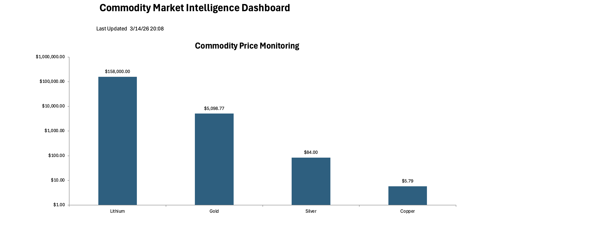

## Tools

Web Data Scraping | Microsoft Excel | Excel VBA | Data Visualization

# Web-Scraped Commodity Dashboard

Excel VBA dashboard that automatically scrapes and visualizes global commodity prices including lithium, gold, silver, and copper.

## Dashboard Preview

Commodity Market Intelligence Dashboard

## Tools Used

* Excel VBA
* Web Data Scraping
* Data Visualization
* Microsoft Excel

## KPIs Analyzed

* Lithium Market Price
* Gold Market Price
* Silver Market Price
* Copper Market Price
* Commodity Price Comparison

## Business Insights

Key insights derived from the commodity dashboard:

* Lithium prices significantly exceed other tracked commodities, reflecting strong demand in battery and EV markets.
* Gold maintains a high-value position compared to industrial metals.
* Silver and copper display much lower absolute prices but remain important industrial indicators.
* The dashboard highlights price scale differences using a logarithmic visualization for clearer comparison.
* Automated price updates allow quick monitoring of global commodity market shifts.

## Project Workflow

1. Excel VBA scrapes commodity price data from online sources.
2. Raw data is stored in the **Raw_Web_Data** sheet.
3. Cleaned and structured values populate the **Market_Data** sheet.
4. The **Dashboard** sheet visualizes commodity price comparisons.

## Key Insights

* Lithium dominates price value among the tracked commodities.
* Gold remains the most valuable traditional precious metal in the dataset.
* Silver and copper show lower values but represent key industrial metals.
* Log-scale visualization enables meaningful comparison across large price differences.
